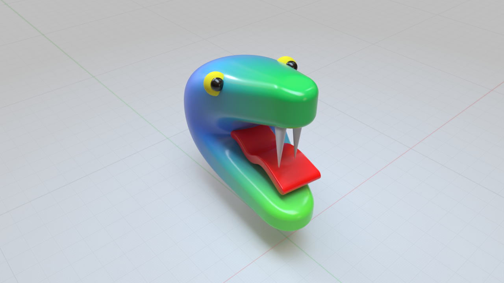
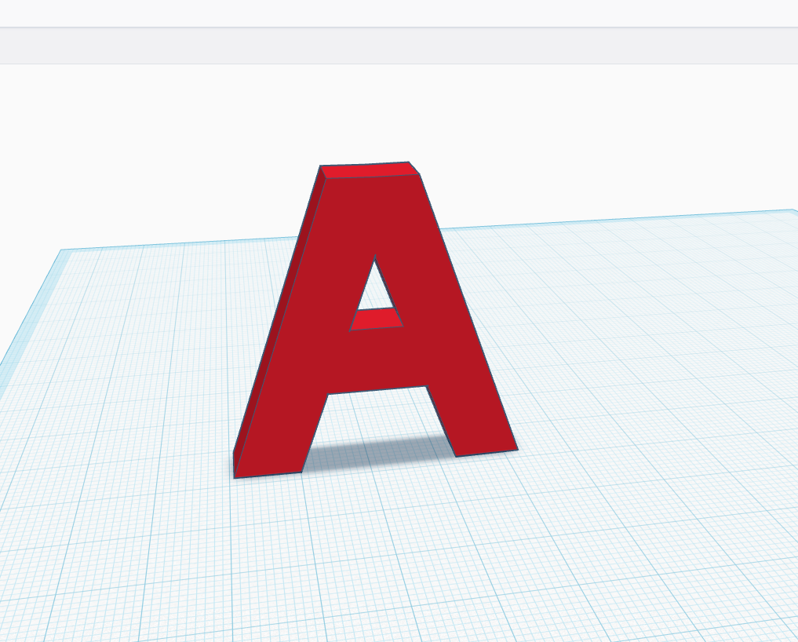

3D Design 8 2025

Avery Nortonsmith

Class-01

1) Class / teacher introduction

https://www.youtube.com/watch?v=yfNFbE0ahi0

https://www.youtube.com/watch?v=ci5K23ZwA20&list=PLWCQ9pa5DxHeZo9tGk2qxj3jl_mpFeYuG&index=2

2) Student introductions

	- Name
	- Experience with 3D design and printing
	- Something you want to make in 3D
	- Something new you’re hoping to learn

3) How do 3D printers work?

4) What are limitations of 3D printing?

5) Tinkercad review

- [Basics](https://www.tinkercad.com/learn/overview/O8XV0X1IRXTXGIH?collectionId=undefined&type=TKCD)

- [More Basics](https://www.tinkercad.com/learn/overview/OPC41AJJKIKDWDV?collectionId=OSZ5W2BL1W5N51F&type=designs)

- [Advanced](https://www.tinkercad.com/blog/22-tips-for-working-faster-in-tinkercad)

6) Task: make the first letter of your first name (from scratch)!

