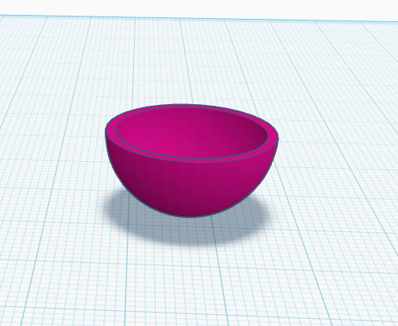
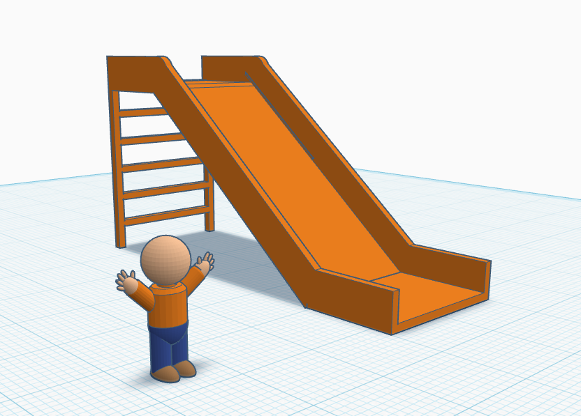

3D Design 8 2025

Avery Nortonsmith

Class-02

1) Seats

2) Do now: make a bowl

3) Class expectations

4) Basic tutorial

https://www.tinkercad.com/learn/overview/O8XV0X1IRXTXGIH?collectionId=undefined&type=TKCD

5) Design a playground

- At least 4 different components
- As much detail as possible
- Make it safe!
- Add people for scale
- Will share at the end of two days
