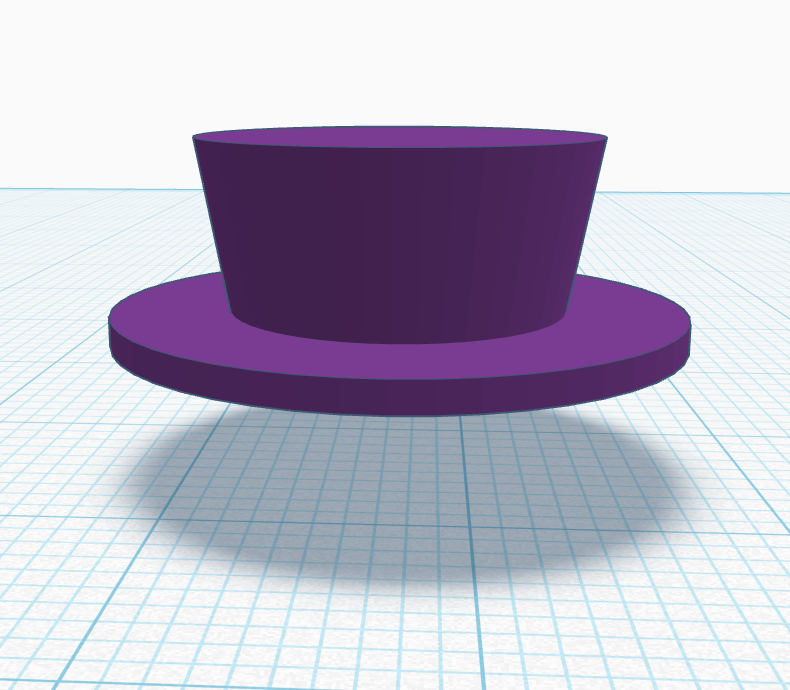
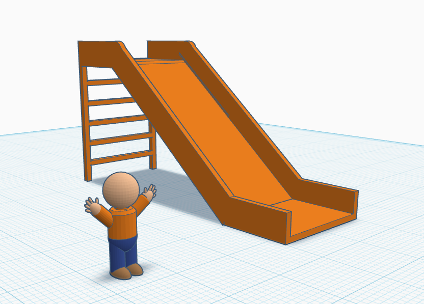

3D Design 8 2025

Avery Nortonsmith

Class-03

1) Do now: make a hat

2) Class expectations

3) Advanced tips article

https://www.tinkercad.com/blog/22-tips-for-working-faster-in-tinkercad

4) Design a playground

- At least 4 different components
- As much detail as possible
- Make it safe!
- Add people for scale
- Will share with class
