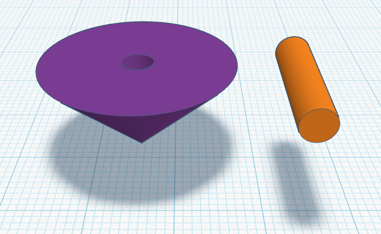

3D Design 8 2025

Avery Nortonsmith

Class-05

1.  You want to print a 3D top. You know that trying to print the body and the handle
    of the top as one piece could complicate the printing process, so you smartly decide
    to print the body and handle of the top as separate pieces.

    You print a prototype of your top, with a 4mm diameter handle and a body with a 4mm
    diameter cylindrical hole for the handle to go in. When you go to assemble the top,
    you discover that the handle won't fit its hole. You consider making the hole larger
    but you know that if the hole is too large then the handle will fall out of the top
    when you try to spin it.
    
    Brainstorm possible methods you could use when designing your next prototype top to
    ensure that the top's handle fits snugly within the body of the top.

2. Review slicer lesson

- Volume vs print time
- Supports
- Adhesion
- Fill
- Resolution

3. Advanced 3D design

https://blog.rahix.de/design-for-3d-printing/

Intro and terminology: https://blog.rahix.de/design-for-3d-printing/#introduction

4. 3D design software landscape, parametric tools

CAD software:

- Parametric vs direct

- Parameters (example: circle diameter)

- Constraints (example: top handle diameter based on hold diameter)

- Features (example: revolve shape to make a vase)

3D design software list:

- Fusion360

- Tinkercad

- OnShape

- Plasticity

- Womp

- Blender

- FreeCAD

- OpenSCAD

5. Womp intro

https://womp.com/

https://www.youtube.com/watch?v=ci5K23ZwA20&list=PLWCQ9pa5DxHeZo9tGk2qxj3jl_mpFeYuG&index=2
